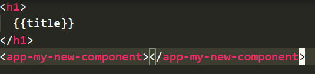
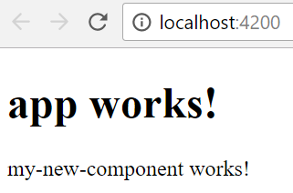
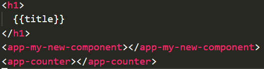
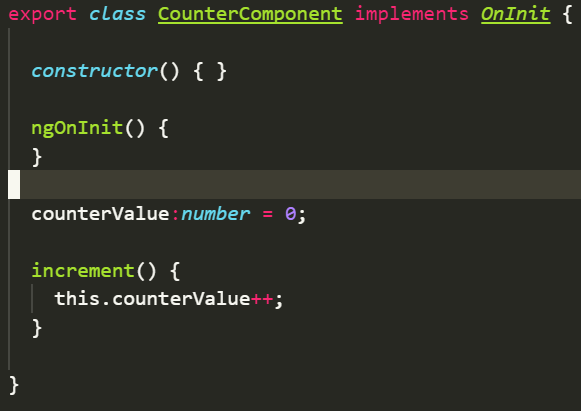
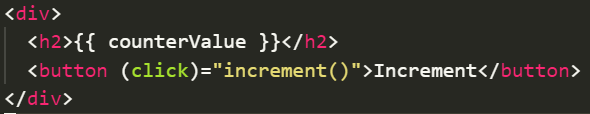
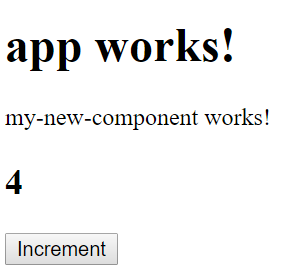

# Lesson 2 - Angular 4 Fundamentals

## Important Links
- [angular.io website](https://angular.io/)
- [angular docs](https://angular.io/docs)

## Introduction
- Read through Angular documentation on [Architecture](https://angular.io/guide/architecture) 

## Fundamental building blocks of Angular application 
- From the same [Architecture](https://angular.io/guide/architecture#wrap-up) page 
- [Modules](https://angular.io/guide/architecture#modules) - An Angular app is made up of 1 or more Modules, at least 1 "root" Module. A Module is a generally a self-contained feature, a reusable piece of functionality eg: a calendar widget 
- [Components](https://angular.io/guide/architecture#components) - A Component controls a patch of screen called a *view*, by defining the template (html and angular directives) for that view, and the interactions of data and events in that view. 
- [Templates](https://angular.io/guide/architecture#templates) - A template is a form of HTML that tells Angular how to render the component. Templates use regular HTML as well as Angular [template syntax](https://angular.io/guide/template-syntax)
- [Metadata](https://angular.io/guide/architecture#metadata) - Metadata tells Angular how to process a class. Metadata is Angular defined decorators like [@Component](https://angular.io/api/core/Component) and [@Directive](https://angular.io/api/core/Directive) which inform Angular about the function(s) our ES6 classes are performing in the app/module.
- [Data binding](https://angular.io/guide/architecture#data-binding) - Data Binding "binds" the data from our class with the appropriate bindings in our templates (HTML/DOM). There are 4 types of data binding between data and our DOM, please see the diagram in the link!
- [Directives](https://angular.io/guide/architecture#directives) - A Directive defines a way of transforming template syntax / mark-up by a set of rules and functions for how that syntax should behave. eg: in the [example template](https://angular.io/guide/architecture#templates) we see Directives for [\*ngFor](https://angular.io/api/common/NgForOf) and [\*ngIf](https://angular.io/api/common/NgIf) 
- [Services](https://angular.io/guide/architecture#services) - Services provide values, functions or features to your Components and Modules. eg: logging service, database service, http request service 
- [Dependency injection](https://angular.io/guide/architecture#dependency-injection) - Dependency Injection is the process of providing your dependencies to your Angular app modules and components so that they are not hard-coded into your component but can be interchanged more easily or even mocked out for testing purposes. 

## Create Angular app with the CLI 
- Recap from Lesson1 to create a new app
- ```ng new my-app```
- ```cd my-app```
- ```npm start``` or ```ng serve``` ( look at package.json, "start" script just runs ng serve )

### What just happened? 
- Angular CLI created a new folder called ```my-app``` and a number of files as the base of the new Angular app
- ```my-app/package.json``` file defines the app dependencies from NPM and other metadata about the app
- Packages are installed from NPM to allow the app to function
- ```ng serve``` starts a web-server that serves the ```src/index.html``` file
- The hot reloading web-server reads this file, injects Angular onto the page, and the "bootstraps" (starts) the Angular app. See ```src/app/app.module.ts``` which imports the AppComponent and bootstraps the app with that component
- ```src/app/app.component.ts``` defines the AppComponent class and links to the template and the css. It also defines the "selector" ```app-root``` which you can see on ```src/index.html``` - this is the directive which Angular is using to insert our AppComponent 

### Create a new component with the CLI 
- ```ng generate component my-new-component``` 
- creates a new folder and files ```src/app/my-new-component```
- adds my-new-component to the declarations in ```src/app/app.module.ts```
- Take a look at ```src/app/my-new-component/my-new-component.component.ts``` 
- The selector for this component is ```app-my-new-component```
- Now edit ```src/app/app.component.html``` template 
- Add our new selector to it at the bottom 



- Save your files and run ```ng serve``` 

- Go to [http://localhost:4200](http://localhost:4200)



- **You should see your new component template is now included in your app!**
- **Components are our fundamental building block for making apps with reusable functionality! **

### Let's build a "Counter" component
#### Specification
- The Counter component should display a number, the counter value in an ```<h2>``` tag
- The Counter component should have an increment button
- Clicking the increment button should add 1 to the counter value and show the updated value on the screen

#### Build

1. Create a new component ```ng generate component counter```

2. Add the Counter selector to our app component



3. Define the counter value and an increment function in our Counter component class



4. Edit the Counter template to display a value in an ```<h2>``` tag

5. Add an increment button to the Counter template and link it to the increment function



6. Test the Counter ```ng serve```



#### Extra Credit
- Define an "increment value" using a text box
- Clicking the increment button should then increment the counter by the increment value 
